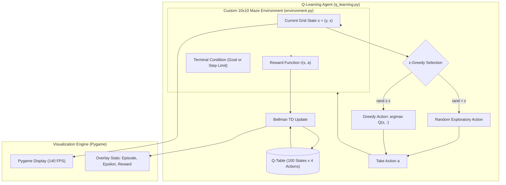

# Autonomous Maze Solver using Reinforcement Learning (Q-Learning)

An autonomous maze navigation agent engineered in Python using tabular **Q-Learning** (Temporal Difference Control) and rendered in real-time with **Pygame**. The agent (represented as a rat) starts with zero prior knowledge of the maze layout, learning through reward-feedback trial and error to avoid traps (obstacles) and discover the global optimal path to the cheese (goal).

---

## Features

- **Tabular Q-Learning Engine (`q_learning.py`)**:
  - Implements off-policy Temporal Difference learning:
    $$Q(s, a) \leftarrow Q(s, a) + \alpha \left[ r + \gamma \max_{a'} Q(s', a') - Q(s, a) \right]$$
  - $\epsilon$-Greedy exploration vs. exploitation policy with exponential decay.
- **Custom GridWorld Environment (`environment.py`)**:
  - Structured following OpenAI Gym environment standards (`reset()`, `step(action)`).
  - $10 \times 10$ discrete grid space with configurable obstacle density and reward structures.
  - Action space: 4 discrete directional transitions (Up, Right, Down, Left).
- **Interactive Pygame Real-Time Visualization (`visualization.py`)**:
  - Dynamic visual updates showing agent exploration history (visited cells in yellow), static obstacle traps (`trap.png`), the target objective (`cheese.png`), and active path traversal.
  - Real-time training dashboard overlay displaying current episode index, $\epsilon$ decay status, and accumulated reward metrics.
- **Optimal Trajectory Execution**:
  - Post-training validation mode that freezes the learned policy ($\epsilon = 0$) and executes the greedy optimal route from start to destination.

---

## Reinforcement Learning Hyperparameters

Verified from [`q_learning.py`](q_learning.py) and [`constants.py`](constants.py):

| Parameter | Symbol / Variable | Value | Description |
|---|---|---|---|
| Grid Dimensions | `GRID_WIDTH`, `GRID_HEIGHT` | $10 \times 10$ | Total state space size: 100 discrete states |
| Cell Pixel Size | `CELL_SIZE` | `70 px` | Window rendering size: $700 \times 700$ px |
| Training Episodes | `episodes` | `1000` | Total training iterations |
| Learning Rate | $\alpha$ | `0.1` | Step size scaling Q-value updates |
| Discount Factor | $\gamma$ | `0.95` | Importance weight of future expected rewards |
| Initial Exploration | $\epsilon_{start}$ | `0.2` | Initial probability of choosing a random action |
| Exploration Decay | `epsilon_decay` | `0.995` | Multiplicative decay per episode |
| Minimum Exploration | $\epsilon_{min}$ | `0.01` | Floor threshold for exploration probability |

---

## System Architecture



---

## Project Structure

```text
Maze-Solver-using-Reinforcement-Learning-Q-Learning-AI/
├── constants.py              # Grid dimensions, window resolutions, and RGB palette
├── environment.py            # Maze layout, obstacle collisions, and step dynamics
├── q_learning.py             # Q-Table initialization, Bellman update, and training loop
├── visualization.py          # Pygame screen renderer and sprite blitting
├── main.py                   # Main entry point to initiate training and execution
├── cheese.png / rat.png      # Goal and agent sprites
├── trap.png                  # Obstacle hazard sprite
├── image.png                 # Maze overview graphic
├── photo1.png / photo2.png   # Exploration and training screenshots
├── photo3.png                # Optimal solution path screenshot
├── AI project-Maze Solver.pdf# Full academic project documentation & analysis
├── Vedio-Maze-Solver.mp4     # Operational video demonstration of the trained agent
└── README.md
```

---

## Visual Demonstration

| Agent Exploration | Solution Path |
|---|---|
|  |  |

| Maze Environment | Training Convergence |
|---|---|
|  |  |

---

## Installation & Running

### Prerequisites
- Python 3.8 or newer
- Dependencies:
  ```bash
  pip install numpy pygame
  ```

### Execution

1. **Clone the repository**:
   ```bash
   git clone https://github.com/Eng-Ghanem/Maze-Solver-using-Reinforcement-Learning-Q-Learning-AI.git
   cd Maze-Solver-using-Reinforcement-Learning-Q-Learning-AI
   ```

2. **Run training & visualization**:
   ```bash
   python main.py
   ```
   The Pygame window will launch, visualizing the agent's exploratory learning across episodes before demonstrating the converged optimal path.

---

## Video & Documentation

- Comprehensive project report: [AI project-Maze Solver.pdf](AI%20project-Maze%20Solver.pdf)
- Execution video: [`Vedio-Maze-Solver.mp4`](Vedio-Maze-Solver.mp4)

---

## Author

- **Mohamed Ghanem** - [Eng-Ghanem](https://github.com/Eng-Ghanem)
